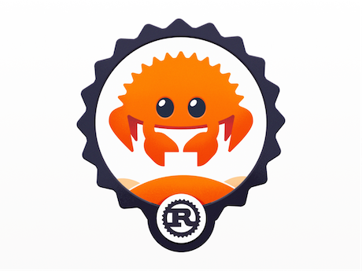

<p align="center">
    
    <h2 align="center">Rusty Days</h2>
</p>

> My journey from JavaScript to Rust

- I'm a web3 dev looking for higher performance.
- Enticed that Rust was voted [**the most loved programming language**](https://insights.stackoverflow.com/survey/2021#technology-most-loved-dreaded-and-wanted)

Rust (aka RustLang) is a language for performance, reliability, and productivity [source](https://www.rust-lang.org/)

## Resources Used:

### Cheat-Sheet

- [Programming Idioms](https://www.programming-idioms.org/cheatsheet/Rust)

### YouTube

- [Rust Crash Course](https://www.youtube.com/watch?v=zF34dRivLOw)

### Books

- [Language by principles](https://doc.rust-lang.org/stable/rust-by-example)
- [Language by examples (harder)](https://doc.rust-lang.org/book)

<br/>
<hr/>

# Projects Completed

- [Brainf\*\*k compiler](./projects/brainf)

<br/>
<hr/>

# Variables

- The two options are `let` and `const`
- Unlike JavaScript, both are immutable in Rust.

## `let`

- The most common
- Write as `snake_case`

## `const`

- Requires explicit typing at initialization `const a:char = 'a'`
- Cannot be marked `mut`
- Write as `SCREAMING_SNAKE_CASE`

<br/>

# Types

## Array-like

> If length is dynamic, you must use `vector`, otherwise arrays and tuples are more optimized

### Vectors

> The most flexible option

```rust
let mut v = vec![0];
println!("element at index {} is {}", 0, vec[0]);
```

### Arrays

> Fixed length at compile-time - Like Tuples except all elements must be of same type

```rust
let a: [i32; 5] = [1, 2, 3, 4, 5];


let months = ["January", "February", "March", "April", "May", "June", "July",
              "August", "September", "October", "November", "December"];

// these two are the same
let a = [3, 3, 3, 3, 3];
let a = [3; 5];

let first = a[0];
let second = a[1];
```

### Tuples

> Fixed Length at compile-time - Not just two elements like some langauges do

- Accessing tuple values is done with `.`

```rust
let long_tuple = (1u8, 2u16, 3u32, 4u64,
                      -1i8, -2i16, -3i32, -4i64,
                      0.1f32, 0.2f64,
                      'a', true);

// Values can be extracted from the tuple using tuple indexing
println!("long tuple first value: {}", long_tuple.0);
println!("long tuple second value: {}", long_tuple.1);
```

- Long tuples cannot be printed

```rust
// long Tuples cannot be printed
// let too_long_tuple = (1, 2, 3, 4, 5, 6, 7, 8, 9, 10, 11, 12, 13);
// println!("too long tuple: {:?}", too_long_tuple);
// TODO ^ Uncomment the above 2 lines to see the compiler error
```

### Functions

- Functions do not need to say `return`

```rust
fn reverse(pair: (i32, bool)) -> (bool, i32) {
    // `let` can be used to bind the members of a tuple to variables
    let (integer, boolean) = pair;

    (boolean, integer)
}
```

## String like

> We have `char`s and two types of `string`s

- Make sure you know if you're working with a [String or a Primitive String](https://youtu.be/zF34dRivLOw?t=2066)

### Char

> Wrapped in `'`. Length 1

```rust
const A:char = 'a';
```

### Primitive String

> Immutable and fixed-length

```rust
let hello = "hello";
```

### String

> Wrapped in `"`. Growable

```rust
let mut hello = String::from("hello");
hello.push('W');
hello.push_str("orld!");
```

# Etc.

## Semicolons mean a lot

> Everything in rust is either a statement or an expression

- Statements do not return values

```rust
fn main() {
    // this is a statement
    let a = 1;

    // this will error
    // the statement `let y = 6` does not return anything
    let x = (let y = 6);
}
```

- This program is valid. Add a semi to `x+1` and not-so!

```rust
fn main() {
    let y = {
        let x = 3;
        // notice the lack of `;`
        // this is a valid expression
        x + 1
    };

    println!("The value of y is: {}", y);
}
```
